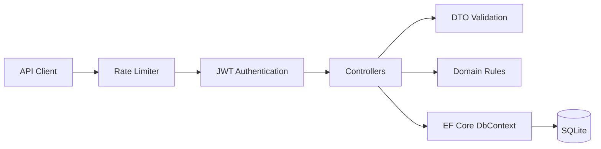
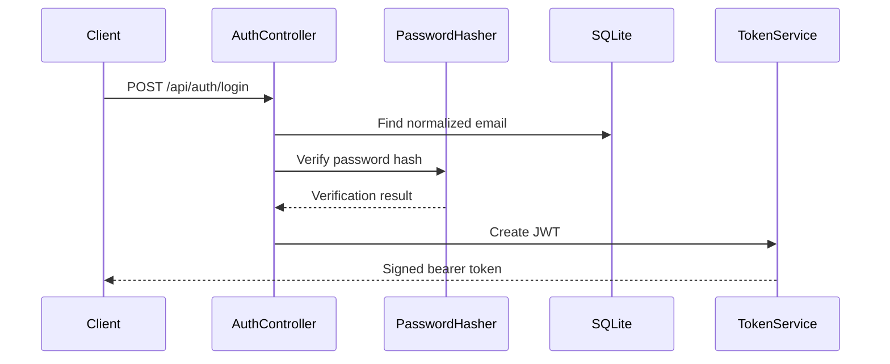

# TaskForge Architecture

TaskForge uses a pragmatic layered structure that keeps HTTP concerns, persistence, contracts, and domain rules separate without over-engineering a portfolio-sized application.

## Request flow

## Authentication flow

## Design decisions

### DTOs instead of exposing entities

API contracts live in `Dtos/`. Entity Framework entities are not returned directly, which prevents accidental over-posting and keeps persistence concerns separate from public API contracts.

### Project ownership

Every project belongs to a user. Queries scope data to the current JWT subject so one user cannot read or mutate another user's projects. The `Admin` role is supported as an explicit authorization bypass for administrative scenarios.

### Work-item state machine

`WorkItemRules` defines allowed status transitions. Keeping this rule outside the controller makes it independently testable and prevents business logic from being hidden inside HTTP code.

### SQLite for portability

SQLite keeps the project easy to clone and run while still demonstrating relational modeling with EF Core. The provider can later be swapped for PostgreSQL or SQL Server through configuration and EF Core provider changes.

### Security defaults

- Password hashing uses ASP.NET Core Identity's password hasher.
- JWT issuer, audience, expiry, signature, and lifetime are validated.
- Protected resources require authentication.
- API endpoints are rate limited.
- Production JWT secrets are expected through environment configuration.

## Future extensions

Good next iterations include refresh tokens, EF Core migrations, PostgreSQL, integration tests with `WebApplicationFactory`, OpenTelemetry, Redis caching, and deployment to Azure Container Apps or another container platform.
